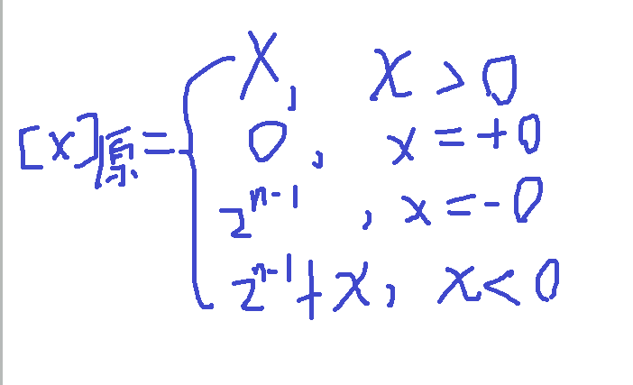
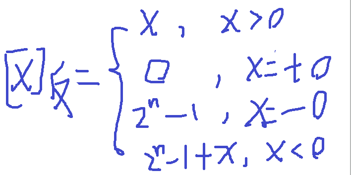
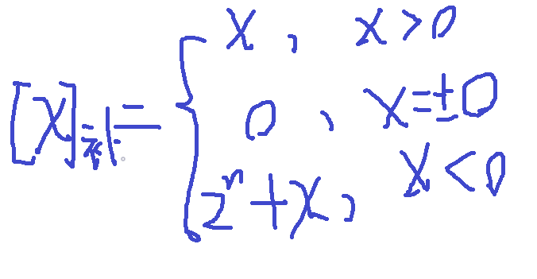
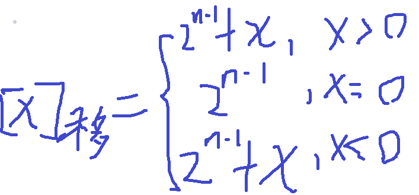

### 

### 机器数与真值

机器数(又称机器码）指一个数在机器中的0-1串表示，有原码、反码、补码、移码等表示方法，有符号位的概念，用0-1数字表示数的符号

真值是这个数真实的值，使用符号来表示数的正负。可以使用多种进制来表示数的真值。

比如-100~(10)~，44~(2）~

### 机器数的四码表示

```javascript
机器数(又称机器码）指一个数在机器中的0-1串表示，有原码、反码、补码、移码等表示方法。
```

通过建立一定的映射关系，我们可以得到由真值得到机器数。

假设用n位0-1串表示数字，下面建立分别建立四码与真值之间的数值映射关系，也就是建立四码的机器数对应的无符号数的值与真值之间的关系。


#### 原码



#### 反码



#### 补码



#### 移码



#### 四码与真值之间的符号运算关系

四码均以最高位为符号为，后面为数值位，对于长度为n的机器数来说：

|编码类型（机器数类型）|符号位|按位取得方式|表示的数据范围|
|-|-|-|-|
|原码|0表示正数，1表示负数|正数的原码等于正数本身（等于其真值对应的二进制无符号数），负数的原码等于其绝对值的二进制无符号表达的符号取反|-2^n-1^-1 \~ 2^n-1^-1|
|反码|0表示正数，1表示负数|正数的补码等于正数本身，负数的补码等于负数的圆满保持符号为不变再数值位按位取反.|-2^n-1^-1 \~ 2^n-1^-1|
|补码|0表示正数，1表示负数|正数的补码等于正数本身，负数的原码等于负数的原码末位+1|-2^n-1^-1 \~ 2^n-1^-1|
|移码|1表示正数，0表示负数|由补码的最高位加1可得|-2^n-1^-1 \~ 2^n-1^-1|

### 两位符号位的数字表示方法

### IEE754浮点数表示

|IEE754浮点数类型|符号位位数|默认扩展位（不保存）值|阶码位数|尾数位数|
|-|-|-|-|-|
|单精度|1|1|8|23|
|双精度|1|1|11|52|
